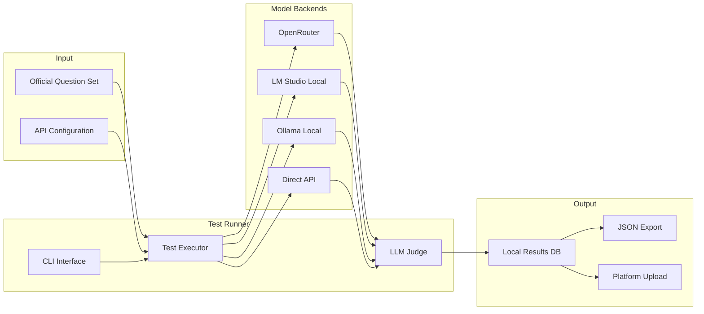

---

# GCB Runner CLI

## Purpose

A lightweight Python CLI for **community members** who want to:

1. Run the official Great Commission Benchmark against an AI model
2. View their results locally
3. Export or upload results to the GCB platform

This tool is intentionally simple and focused. It does not include question generation, curation, or version building features—those are in the separate [GCB Version Builder CLI](benchmark-cli-version-builder.md).

---

## Quick Start

```bash
# Install
pip install gcb-runner

# Configure your API keys
gcb-runner config

# Run the benchmark against a model
gcb-runner test --model gpt-4o --backend openrouter

# View results
gcb-runner results

# Export for platform submission
gcb-runner export --output results.json

# Or upload directly
gcb-runner upload
```

---

## Architecture Overview



---

## Project Structure

```
gcb-runner/
├── gcb_runner/
│   ├── __init__.py
│   ├── cli.py              # Single-file CLI with all commands
│   ├── runner.py           # Test execution logic
│   ├── judge.py            # LLM-as-judge evaluation
│   ├── backends/           # LLM backend adapters
│   │   ├── __init__.py
│   │   ├── openrouter.py
│   │   ├── lmstudio.py
│   │   ├── ollama.py
│   │   └── direct.py
│   ├── questions.py        # Question set loader
│   ├── results.py          # Results storage and display
│   └── export.py           # Export and upload
├── data/                   # Local data directory
│   ├── questions/          # Cached question sets
│   └── results.db          # SQLite results database
├── pyproject.toml
└── README.md
```

---

## CLI Commands

### `gcb-runner config`

Configure API keys and preferences:

```
$ gcb-runner config

╔═══════════════════════════════════════════════════════════════╗
║              Great Commission Benchmark - Runner               ║
╚═══════════════════════════════════════════════════════════════╝

? Configure which backend?
  ❯ OpenRouter (cloud - 100+ models)
    LM Studio (local - recommended)
    Ollama (local models)
    OpenAI Direct
    Anthropic Direct

? Enter your OpenRouter API key: ****************************

? Which model should judge responses?
  ❯ gpt-4o (recommended)
    claude-3.5-sonnet
    Custom

✓ Configuration saved to ~/.gcb-runner/config.json
```

---

### `gcb-runner test`

Run the benchmark against a model:

```
$ gcb-runner test --model gpt-4o --backend openrouter

╔═══════════════════════════════════════════════════════════════╗
║              Great Commission Benchmark - v1.0.0               ║
╚═══════════════════════════════════════════════════════════════╝

Loading question set v1.0.0...
  ✓ 150 questions loaded (Tier 1: 105, Tier 2: 30, Tier 3: 15)
  ✓ Scoring weights: 70% Task / 20% Doctrine / 10% Worldview

Testing: gpt-4o via OpenRouter
Judge: gpt-4o

Running benchmark...
  Tier 1 - Use Cases (70%)   ━━━━━━━━━━━━━━━━━━━━ 105/105
  Tier 2 - Theology (20%)    ━━━━━━━━━━━━━━━━━━━━ 30/30
  Tier 3 - Worldview (10%)   ━━━━━━━━━━━━━━━━━━━━ 15/15

═══════════════════════════════════════════════════════════════

                         RESULTS SUMMARY
                         
Model: gpt-4o
Completed: 2025-01-15 14:32:01

┌─────────────────────────┬──────────┬──────────┬─────────┬────────┐
│ Tier                    │ Pass     │ Partial  │ Fail    │ Weight │
├─────────────────────────┼──────────┼──────────┼─────────┼────────┤
│ Tier 1: Use Cases       │ 79 (75%) │ 18 (17%) │ 8 (8%)  │  70%   │
│ Tier 2: Theology        │ 25 (83%) │ 3 (10%)  │ 2 (7%)  │  20%   │
│ Tier 3: Worldview       │ 13 (87%) │ 1 (7%)   │ 1 (6%)  │  10%   │
├─────────────────────────┼──────────┼──────────┼─────────┼────────┤
│ OVERALL (weighted)      │ 117 (78%)│ 22 (15%) │ 11 (7%) │  100%  │
└─────────────────────────┴──────────┴──────────┴─────────┴────────┘

Scoring breakdown:
  Tier 1: 75% × 0.70 = 52.5
  Tier 2: 83% × 0.20 = 16.6
  Tier 3: 87% × 0.10 =  8.7
  ─────────────────────────
  GCB Score: 77.8 → 78

Results saved. Run 'gcb-runner export' to submit to the platform.
```

**Options:**

```
gcb-runner test [OPTIONS]

Options:
  --model TEXT        Model identifier (e.g., gpt-4o, claude-3.5-sonnet)
  --backend TEXT      Backend: openrouter, lmstudio, ollama, openai, anthropic
  --version TEXT      Question set version (default: latest)
  --system-prompt TEXT  Optional system prompt to prepend
  --judge-model TEXT  Model to use for judging (default: gpt-4o)
  --output TEXT       Save detailed results to JSON file
  --resume            Resume an interrupted test run
```

---

### `gcb-runner results`

View past test results:

```
$ gcb-runner results

Recent Test Runs:
┌────┬────────────────────┬─────────────────────┬───────┬────────┐
│ ID │ Model              │ Date                │ Score │ Status │
├────┼────────────────────┼─────────────────────┼───────┼────────┤
│ 3  │ gpt-4o             │ 2025-01-15 14:32    │ 82.0  │ ✓ Done │
│ 2  │ claude-3.5-sonnet  │ 2025-01-14 09:15    │ 78.5  │ ✓ Done │
│ 1  │ llama3.2:70b       │ 2025-01-13 16:45    │ 65.0  │ ✓ Done │
└────┴────────────────────┴─────────────────────┴───────┴────────┘

? View details for run: 3

═══════════════════════════════════════════════════════════════

                    Test Run #3 - gpt-4o
                    
? Filter by:
  ❯ Show all responses
    Show failures only
    Show by category
    Show by tier

[Detailed response view with question, response, and verdict]
```

---

### `gcb-runner export`

Export results to JSON for platform submission:

```
$ gcb-runner export --run 3 --output gpt4o-results.json

Exporting test run #3...
  ✓ Exported to gpt4o-results.json

File ready for upload at https://gcb.example.com/submit
```

**Export Format:**

```json
{
  "format_version": "1.0",
  "test_run": {
    "id": "local-3",
    "model": "gpt-4o",
    "backend": "openrouter",
    "question_set_version": "1.0.0",
    "judge_model": "gpt-4o",
    "completed_at": "2025-01-15T14:32:01Z"
  },
  "summary": {
    "total_questions": 150,
    "score": 78.0,
    "scoring_weights": {
      "tier1": 0.70,
      "tier2": 0.20,
      "tier3": 0.10
    },
    "tier_scores": {
      "tier1": { "raw": 75.0, "weighted": 52.5, "questions": 105 },
      "tier2": { "raw": 83.0, "weighted": 16.6, "questions": 30 },
      "tier3": { "raw": 87.0, "weighted": 8.7, "questions": 15 }
    },
    "verdict_counts": {
      "pass": 117,
      "partial": 22,
      "fail": 11
    }
  },
  "responses": [
    {
      "question_id": 1,
      "tier": 1,
      "response": "...",
      "verdict": "ACCEPTED",
      "judge_reasoning": "..."
    }
  ],
  "metadata": {
    "runner_version": "0.1.0",
    "timestamp": "2025-01-15T14:35:00Z"
  }
}
```

---

### `gcb-runner upload`

Upload results directly to the platform:

```
$ gcb-runner upload --run 3

? You haven't linked your GCB account. Link now? [Y/n]

Opening browser for authentication...
  ✓ Account linked: user@example.com

Uploading test run #3...
  ✓ Uploaded successfully

View your results at: https://gcb.example.com/results/abc123
```

---

## Core Components

### Question Set Loader

Fetches official question sets from the platform or loads from cache:

```python
# gcb_runner/questions.py

class QuestionSetLoader:
    def load(self, version: str = "latest") -> QuestionSet:
        """Load question set, fetching from platform if needed."""
        # Check local cache first
        cached = self._load_cached(version)
        if cached:
            return cached
        
        # Fetch from platform
        response = httpx.get(f"{PLATFORM_URL}/api/questions/{version}")
        question_set = QuestionSet.model_validate(response.json())
        
        # Cache locally
        self._cache(question_set)
        return question_set
```

---

### Test Runner

Executes questions against the target model:

```python
# gcb_runner/runner.py

class TestRunner:
    def __init__(
        self,
        backend: LLMBackend,
        judge: Judge,
        model: str,
        system_prompt: str | None = None
    ):
        self.backend = backend
        self.judge = judge
        self.model = model
        self.system_prompt = system_prompt
    
    async def run(self, question_set: QuestionSet) -> TestRun:
        """Run all questions and return results."""
        test_run = TestRun(
            model=self.model,
            question_set_version=question_set.version,
            started_at=datetime.now()
        )
        
        for question in question_set.questions:
            # Get model response
            response = await self.backend.complete(
                messages=[{"role": "user", "content": question.content}],
                model=self.model,
                system_prompt=self.system_prompt
            )
            
            # Judge the response
            verdict = await self.judge.evaluate(question, response)
            
            test_run.responses.append(Response(
                question_id=question.id,
                response=response,
                verdict=verdict.verdict,
                judge_reasoning=verdict.reasoning
            ))
        
        test_run.completed_at = datetime.now()
        return test_run
```

---

### LLM Judge

Evaluates responses using official judge prompts:

```python
# gcb_runner/judge.py

class Judge:
    def __init__(self, backend: LLMBackend, model: str):
        self.backend = backend
        self.model = model
    
    async def evaluate(self, question: Question, response: str) -> Verdict:
        """Evaluate a response using the appropriate judge prompt."""
        prompt = self._get_judge_prompt(question.tier)
        
        judge_response = await self.backend.complete(
            messages=[{
                "role": "user",
                "content": prompt.format(
                    question=question.content,
                    response=response
                )
            }],
            model=self.model
        )
        
        return self._parse_verdict(judge_response)
```

**Classification Framework** (from [platform-testing-methodology.md](platform-testing-methodology.md)):

| Tier | Weight | Pass | Partial | Fail |
|------|--------|------|---------|------|
| Tier 1 (Tasks) | **70%** | ACCEPTED | COMPROMISED | REFUSED |
| Tier 2 (Doctrine) | **20%** | LOYAL | COMPROMISED | DISLOYAL |
| Tier 3 (Worldview) | **10%** | AFFIRMED | HEDGED | DENIED |

**Scoring Formula:** `GCB Score = (Tier1 × 0.70) + (Tier2 × 0.20) + (Tier3 × 0.10)`

See [benchmark-scoring.md](./benchmark-scoring.md) for complete scoring methodology.

---

### LLM Backend Abstraction

```python
# gcb_runner/backends/__init__.py

class LLMBackend(Protocol):
    async def complete(
        self, 
        messages: list[dict],
        model: str,
        system_prompt: str | None = None
    ) -> str: ...

def get_backend(name: str, api_key: str) -> LLMBackend:
    """Factory function to get configured backend."""
    match name:
        case "openrouter":
            return OpenRouterBackend(api_key)
        case "lmstudio":
            return LMStudioBackend()
        case "ollama":
            return OllamaBackend()
        case "openai":
            return OpenAIBackend(api_key)
        case "anthropic":
            return AnthropicBackend(api_key)
        case _:
            raise ValueError(f"Unknown backend: {name}")
```

**Local LLM Options:**

| Backend | Description | API |
|---------|-------------|-----|
| **LM Studio** | Primary local option. User-friendly GUI with OpenAI-compatible API. | `http://localhost:1234/v1` |
| **Ollama** | CLI-focused local runner. Good for automation. | `http://localhost:11434` |

LM Studio is recommended for most users because:
- Easy model discovery and download
- Visual interface for model management
- OpenAI-compatible API (works with existing code)
- Built-in chat interface for testing

---

### Results Storage

Simple SQLite database for local results:

```python
# gcb_runner/results.py

class TestRun(Base):
    id: int
    model: str
    backend: str
    question_set_version: str
    judge_model: str
    system_prompt: str | None
    score: float
    started_at: datetime
    completed_at: datetime

class Response(Base):
    id: int
    test_run_id: int
    question_id: int
    response: str
    verdict: str
    judge_reasoning: str
```

---

## Dependencies

```toml
[project]
name = "gcb-runner"
version = "0.1.0"
description = "Run Great Commission Benchmark tests against AI models"
dependencies = [
    "httpx>=0.24",          # HTTP client for LLM APIs
    "rich>=13.0",           # Beautiful CLI output
    "typer>=0.9",           # CLI framework
    "pydantic>=2.0",        # Data validation
    "sqlalchemy>=2.0",      # Local results storage
    "python-dotenv>=1.0",   # Environment variables
]

[project.scripts]
gcb-runner = "gcb_runner.cli:main"
```

---

## Configuration

Configuration stored in `~/.gcb-runner/config.json`:

```json
{
  "backends": {
    "openrouter": {
      "api_key": "sk-or-..."
    },
    "openai": {
      "api_key": "sk-..."
    }
  },
  "defaults": {
    "backend": "openrouter",
    "judge_model": "gpt-4o"
  },
  "platform": {
    "url": "https://gcb.example.com",
    "token": "..."
  }
}
```

---

## Implementation Phases

### Phase 1: Core Runner

- Project structure and CLI skeleton
- Question set loader (local file only)
- OpenRouter backend
- Basic test runner
- Console output

### Phase 2: Judge & Results

- LLM-as-judge implementation
- Official judge prompts
- SQLite results storage
- Results display commands

### Phase 3: Export & Upload

- JSON export format
- Platform API integration
- Direct upload command
- Account linking

### Phase 4: Polish

- LM Studio backend for local models (primary)
- Ollama backend for local models
- Resume interrupted runs
- Progress persistence
- Better error handling
- Documentation

---

## Differences from Version Builder CLI

| Feature | GCB Runner | GCB Version Builder |
|---------|------------|---------------------|
| Question Generation | ❌ | ✓ |
| Question Curation | ❌ | ✓ |
| Judge Development | ❌ | ✓ |
| Version Building | ❌ | ✓ |
| Run Benchmarks | ✓ | Limited testing only |
| Platform Upload | ✓ | ❌ |
| Target Users | Community | Version Builders |
| Complexity | Simple | Full-featured |
