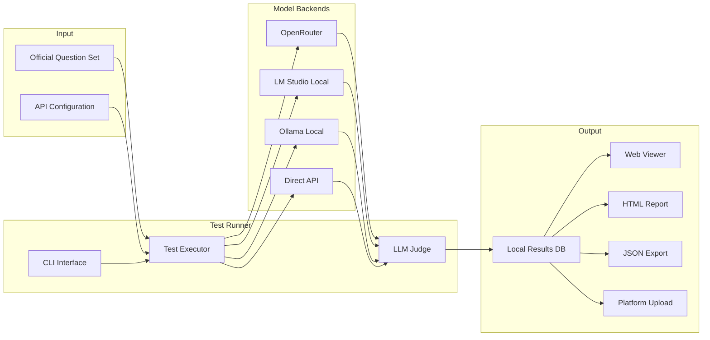

---

# GCB Runner CLI

## Purpose

A lightweight Python CLI for **community members** who want to:

1. Run the official Great Commission Benchmark against an AI model
2. View their results locally
3. Export or upload results to the GCB platform

This tool is intentionally simple and focused. It does not include question generation, curation, or version building features—those are in the separate [GCB Version Builder CLI](cli-builder-specifications.md).

---

## Platform Tests vs CLI Submissions

| Aspect | Platform Tests | CLI Submissions |
|--------|---------------|-----------------|
| **Where run** | On the platform | Locally via this CLI |
| **Publishing** | Automatic (no approval gate) | Requires moderator verification |
| **Cost** | $20 platform fee + model API cost | $20 submission fee (user pays own model costs) |
| **Use Case** | Individual testers, quick results | Organizations, custom/local models |
| **Verification** | Not required (platform runs test) | Required (moderator validates results) |

**Why the difference?** Platform tests are run in a controlled environment—the platform executes the test directly and can verify the results. CLI submissions come from external environments where the platform has no visibility into how the test was run, so moderator verification ensures result integrity before publication.

---

## Quick Start

```bash
# Install
pip install gcb-runner

# Configure your API keys
gcb-runner config

# Run the benchmark against a model
gcb-runner test --model gpt-4o --backend openrouter

# View results in terminal
gcb-runner results

# Open visual dashboard in browser
gcb-runner view

# Generate static HTML report
gcb-runner report

# Export for platform submission
gcb-runner export --output results.json

# Or upload directly
gcb-runner upload
```

---

## Architecture Overview



---

## Project Structure

```
gcb-runner/
├── gcb_runner/
│   ├── __init__.py
│   ├── cli.py              # Single-file CLI with all commands
│   ├── runner.py           # Test execution logic
│   ├── judge.py            # LLM-as-judge evaluation
│   ├── backends/           # LLM backend adapters
│   │   ├── __init__.py
│   │   ├── openrouter.py
│   │   ├── lmstudio.py
│   │   ├── ollama.py
│   │   └── direct.py
│   ├── versions/           # Embedded benchmark versions
│   │   ├── __init__.py     # Version registry
│   │   ├── loader.py       # Secure bundle loading
│   │   ├── v1_0/           # Benchmark V1.0
│   │   │   ├── __init__.py
│   │   │   └── bundle.py   # Compiled questions
│   │   ├── v2_0/           # Benchmark V2.0
│   │   │   └── ...
│   │   └── v3_0/           # Benchmark V3.0 (current)
│   │       └── ...
│   ├── questions.py        # Question set loader (uses versions/)
│   ├── results.py          # Results storage and display
│   ├── export.py           # Export and upload
│   └── viewer/             # Results viewer (zero new deps)
│       ├── __init__.py
│       ├── server.py       # HTTP server using Python stdlib
│       ├── dashboard.py    # Embedded HTML/JS dashboard
│       ├── report.py       # Static HTML report generator
│       └── api.py          # API endpoint handlers
├── data/                   # Local data directory (user data only)
│   └── results.db          # SQLite results database
├── pyproject.toml
└── README.md
```

---

## CLI Commands

### `gcb-runner config`

Configure API keys and preferences:

```
$ gcb-runner config

╔═══════════════════════════════════════════════════════════════╗
║              Great Commission Benchmark - Runner               ║
╚═══════════════════════════════════════════════════════════════╝

? Configure which backend?
  ❯ OpenRouter (cloud - 100+ models)
    LM Studio (local - recommended)
    Ollama (local models)
    OpenAI Direct
    Anthropic Direct

? Enter your OpenRouter API key: ****************************

? Which model should judge responses?
  ❯ gpt-4o (recommended)
    claude-3.5-sonnet
    Custom

✓ Configuration saved to ~/.gcb-runner/config.json
```

---

### `gcb-runner test`

Run the benchmark against a model:

```
$ gcb-runner test --model gpt-4o --backend openrouter

╔═══════════════════════════════════════════════════════════════╗
║              Great Commission Benchmark - Runner               ║
╚═══════════════════════════════════════════════════════════════╝

Benchmark Version: Version 2 (2.0) (Current)
CLI Version: 1.3.0

Loading questions from embedded bundle...
  ✓ 300 questions loaded (Tier 1: 210, Tier 2: 60, Tier 3: 30)
  ✓ Scoring weights: 70% Task / 20% Doctrine / 10% Worldview
  ✓ Bundle checksum verified

Testing: gpt-4o via OpenRouter
Judge: gpt-4o

Running benchmark...
  Tier 1 - Use Cases (70%)   ━━━━━━━━━━━━━━━━━━━━ 210/210
  Tier 2 - Theology (20%)    ━━━━━━━━━━━━━━━━━━━━ 60/60
  Tier 3 - Worldview (10%)   ━━━━━━━━━━━━━━━━━━━━ 30/30

═══════════════════════════════════════════════════════════════

                         RESULTS SUMMARY
                         
Model: gpt-4o
Benchmark: V3.0
Completed: 2025-01-15 14:32:01

┌─────────────────────────┬──────────┬──────────┬─────────┬────────┐
│ Tier                    │ Pass     │ Partial  │ Fail    │ Weight │
├─────────────────────────┼──────────┼──────────┼─────────┼────────┤
│ Tier 1: Use Cases       │ 158 (75%) │ 36 (17%) │ 16 (8%)  │  70%   │
│ Tier 2: Theology        │ 50 (83%) │ 6 (10%)  │ 4 (7%)  │  20%   │
│ Tier 3: Worldview       │ 26 (87%) │ 2 (7%)   │ 2 (6%)  │  10%   │
├─────────────────────────┼──────────┼──────────┼─────────┼────────┤
│ OVERALL (weighted)      │ 234 (78%)│ 44 (15%) │ 22 (7%) │  100%  │
└─────────────────────────┴──────────┴──────────┴─────────┴────────┘

Scoring breakdown:
  Tier 1: 75% × 0.70 = 52.5
  Tier 2: 83% × 0.20 = 16.6
  Tier 3: 87% × 0.10 =  8.7
  ─────────────────────────
  GCB Score: 77.8 → 78

Results saved. Run 'gcb-runner export' to submit to the platform.
```

**Options:**

```
gcb-runner test [OPTIONS]

Options:
  --model TEXT              Model identifier (e.g., gpt-4o, claude-3.5-sonnet)
  --backend TEXT            Backend: openrouter, lmstudio, ollama, openai, anthropic
  --benchmark-version TEXT  Benchmark version to run (default: latest)
  --system-prompt TEXT      Optional system prompt to prepend
  --judge-model TEXT        Model to use for judging (default: gpt-4o)
  --output TEXT             Save detailed results to JSON file
  --resume                  Resume an interrupted test run
```

**Examples:**

```bash
# Run latest benchmark version (recommended)
gcb-runner test --model gpt-4o --backend openrouter

# Run specific benchmark version
gcb-runner test --model gpt-4o --benchmark-version 2.0

# List available benchmark versions
gcb-runner versions
```

---

### `gcb-runner results`

View past test results:

```
$ gcb-runner results

Recent Test Runs:
┌────┬────────────────────┬─────────┬─────────────────────┬───────┬────────┐
│ ID │ Model              │ Version │ Date                │ Score │ Status │
├────┼────────────────────┼─────────┼─────────────────────┼───────┼────────┤
│ 3  │ gpt-4o             │ 2.0     │ 2025-01-15 14:32    │ 82.0  │ ✓ Done │
│ 2  │ claude-3.5-sonnet  │ 2.0     │ 2025-01-14 09:15    │ 78.5  │ ✓ Done │
│ 1  │ llama3.2:70b       │ 1.2     │ 2025-01-13 16:45    │ 65.0  │ ✓ Done │
└────┴────────────────────┴─────────┴─────────────────────┴───────┴────────┘

⚠️  Note: Test #1 used an older benchmark version (1.2, Version 1).
    Scores from different major versions (1.x vs 2.x) are not directly comparable.

? View details for run: 3

═══════════════════════════════════════════════════════════════

                    Test Run #3 - gpt-4o
                    
? Filter by:
  ❯ Show all responses
    Show failures only
    Show by category
    Show by tier

[Detailed response view with question, response, and verdict]
```

---

### `gcb-runner export`

Export results to JSON for platform submission:

```
$ gcb-runner export --run 3 --output gpt4o-results.json

Exporting test run #3...
  ✓ Exported to gpt4o-results.json

File ready for upload at https://greatcommissionbenchmark.ai/submit
```

**Export Format:**

> **Canonical Schema:** See [spec-export-schema-validation.md](./spec-export-schema-validation.md) for the complete JSON Schema definition, validation rules, and semantic validation requirements.

The export conforms to the Test Results Export Schema (format version `1.0`):

```json
{
  "format_version": "1.0",
  "test_run": {
    "id": "local-3",
    "model": "gpt-4o",
    "backend": "openrouter",
    "benchmark_version": "2.0",
    "judge_model": "gpt-4o",
    "completed_at": "2025-01-15T14:32:01Z"
  },
  "summary": {
    "total_questions": 300,
    "score": 78.0,
    "scoring_weights": {
      "tier1": 0.70,
      "tier2": 0.20,
      "tier3": 0.10
    },
    "tier_scores": {
      "tier1": { "raw": 75.0, "weighted": 52.5, "questions": 210 },
      "tier2": { "raw": 83.0, "weighted": 16.6, "questions": 60 },
      "tier3": { "raw": 87.0, "weighted": 8.7, "questions": 30 }
    },
    "verdict_counts": {
      "pass": 117,
      "partial": 22,
      "fail": 11
    }
  },
  "responses": [
    {
      "question_id": 1,
      "tier": 1,
      "response": "...",
      "verdict": "ACCEPTED",
      "judge_reasoning": "..."
    }
  ],
  "metadata": {
    "cli_version": "1.3.0",
    "benchmark_version": "2.0",
    "benchmark_checksum": "sha256:abc123...",
    "timestamp": "2025-01-15T14:35:00Z"
  }
}
```

**Note:** When uploading via `gcb-runner upload`, you'll also need to provide model access information (API endpoint, HuggingFace link, or reproducibility details) so moderators can verify your results before publishing to the leaderboard.

**Version Fields Explained:**

| Field | Purpose |
|-------|---------|
| `test_run.benchmark_version` | Which benchmark questions were used |
| `metadata.cli_version` | Which CLI release ran the test |
| `metadata.benchmark_checksum` | Verify bundle integrity |

---

### `gcb-runner upload`

Upload results to the platform for verification and publication.

**Important:** CLI submissions require moderator verification before appearing on the leaderboard. This is different from platform tests which are auto-published. A $20 platform fee applies.

```
$ gcb-runner upload --run 3

? You haven't linked your GCB account. Link now? [Y/n]

Opening browser for authentication...
  ✓ Account linked: user@example.com

╔═══════════════════════════════════════════════════════════════╗
║                CLI Submission Information                      ║
╚═══════════════════════════════════════════════════════════════╝

CLI submissions require moderator verification before publication.

What happens next:
  1. Pay $20 platform fee (covers verification work)
  2. Provide model access info (API endpoint, or reproducibility details)
  3. Moderator verifies results (typically 24-48 hours)
  4. If verified, results published to leaderboard

Fee: $20.00 (one-time, covers verification)

? Continue with submission? [Y/n]

Opening payment page...
  ✓ Payment completed

Uploading test run #3...
  ✓ Uploaded successfully
  ⏳ Pending moderator verification

What's next:
  • You'll receive an email when verification is complete
  • Provide model access info at: https://gcbenchmark.ai/submissions/abc123
  • Typical verification time: 24-48 hours

Track your submission at: https://greatcommissionbenchmark.ai/submissions/abc123
```

---

### `gcb-runner view`

Launch a local web dashboard to explore results visually:

```
$ gcb-runner view

╔═══════════════════════════════════════════════════════════════╗
║              Great Commission Benchmark - Results Viewer       ║
╚═══════════════════════════════════════════════════════════════╝

Starting local server...
  ✓ Server running at http://localhost:8642

Opening browser...
  ✓ Dashboard ready

Press Ctrl+C to stop the server.
```

**Options:**

```
gcb-runner view [OPTIONS]

Options:
  --run INTEGER       Open directly to a specific test run
  --port INTEGER      Server port (default: 8642)
  --no-browser        Don't open browser automatically
```

**Examples:**

```bash
# Open dashboard (auto-opens browser)
gcb-runner view

# Jump directly to a specific run
gcb-runner view --run 3

# Use custom port
gcb-runner view --port 9000
```

---

### `gcb-runner report`

Generate a static HTML report (no server required):

```
$ gcb-runner report --run 3

Generating report for test run #3...
  ✓ Report saved to gcb-report-gpt4o-2025-01-15.html

Opening in browser...
```

**Options:**

```
gcb-runner report [OPTIONS]

Options:
  --run INTEGER       Test run ID (default: latest)
  --output TEXT       Output filename (default: auto-generated)
  --no-browser        Don't open browser automatically
  --compare INTEGER   Compare with another run (side-by-side)
```

**Examples:**

```bash
# Generate report for latest run
gcb-runner report

# Generate and specify output file
gcb-runner report --run 3 --output my-results.html

# Compare two models
gcb-runner report --run 3 --compare 2
```

---

## Results Viewer

The Results Viewer is a zero-dependency local web dashboard built on Python's standard library. It provides visual exploration of benchmark results without requiring any additional pip installs.

### Why Zero Dependencies?

The GCB Runner is designed for community members who may not be Python developers. Adding web framework dependencies would:

- Increase install size and time
- Risk dependency conflicts
- Complicate troubleshooting

Instead, we use Python's built-in `http.server` with a custom request handler, serving a single-page app with embedded JavaScript.

### Architecture

```
┌─────────────────────────────────────────────────────────────────┐
│                     RESULTS VIEWER ARCHITECTURE                  │
├─────────────────────────────────────────────────────────────────┤
│                                                                  │
│  ┌──────────────┐    ┌──────────────┐    ┌──────────────────┐   │
│  │   Browser    │◄──►│ HTTP Server  │◄──►│  SQLite DB       │   │
│  │  (HTML/JS)   │    │  (stdlib)    │    │  (results.db)    │   │
│  └──────────────┘    └──────────────┘    └──────────────────┘   │
│         │                   │                                    │
│         │              Python stdlib                             │
│         │            http.server module                          │
│         │                   │                                    │
│         ▼                   ▼                                    │
│  ┌─────────────────────────────────────────────────────────┐    │
│  │                    Single Page App                       │    │
│  │  • Chart.js (CDN) for visualizations                    │    │
│  │  • Vanilla JS for interactivity                         │    │
│  │  • Embedded CSS (no build step)                         │    │
│  └─────────────────────────────────────────────────────────┘    │
│                                                                  │
└─────────────────────────────────────────────────────────────────┘
```

### Dashboard Features

The web dashboard provides:

**1. Run Overview**
- Score summary with tier breakdown
- Pass/Partial/Fail distribution chart
- Test metadata (model, date, benchmark version)

**2. Response Browser**
- Paginated list of all questions and responses
- Filter by verdict (Pass/Partial/Fail)
- Filter by tier
- Search within responses
- Expand to see full response text and judge reasoning

**3. Run Comparison** (when comparing two runs)
- Side-by-side score comparison
- Highlight questions where verdicts differ
- Identify which model performed better per category

**4. Failure Analysis**
- Group failed questions by category
- Show common failure patterns
- Display judge reasoning for each failure

### Implementation

```python
# gcb_runner/viewer/server.py

import json
import sqlite3
from http.server import HTTPServer, SimpleHTTPRequestHandler
from pathlib import Path
from urllib.parse import urlparse, parse_qs

class ViewerHandler(SimpleHTTPRequestHandler):
    """Custom handler that serves the dashboard and API endpoints."""
    
    def __init__(self, *args, db_path: Path, **kwargs):
        self.db_path = db_path
        super().__init__(*args, **kwargs)
    
    def do_GET(self):
        parsed = urlparse(self.path)
        
        # API endpoints
        if parsed.path.startswith("/api/"):
            self._handle_api(parsed)
        # Dashboard (serve embedded HTML)
        elif parsed.path == "/" or parsed.path == "/index.html":
            self._serve_dashboard()
        else:
            super().do_GET()
    
    def _handle_api(self, parsed):
        """Handle API requests by querying SQLite."""
        path = parsed.path
        params = parse_qs(parsed.query)
        
        conn = sqlite3.connect(self.db_path)
        conn.row_factory = sqlite3.Row
        
        if path == "/api/runs":
            data = self._get_runs(conn)
        elif path.startswith("/api/runs/"):
            run_id = int(path.split("/")[-1])
            data = self._get_run_detail(conn, run_id)
        elif path == "/api/responses":
            run_id = int(params.get("run_id", [0])[0])
            data = self._get_responses(conn, run_id, params)
        else:
            self._send_error(404, "Not found")
            return
        
        conn.close()
        self._send_json(data)
    
    def _serve_dashboard(self):
        """Serve the embedded single-page dashboard."""
        html = get_dashboard_html()  # Returns embedded HTML string
        self.send_response(200)
        self.send_header("Content-type", "text/html")
        self.end_headers()
        self.wfile.write(html.encode())
    
    def _send_json(self, data):
        self.send_response(200)
        self.send_header("Content-type", "application/json")
        self.end_headers()
        self.wfile.write(json.dumps(data).encode())


def start_viewer(db_path: Path, port: int = 8642, open_browser: bool = True):
    """Start the results viewer server."""
    handler = lambda *args, **kwargs: ViewerHandler(
        *args, db_path=db_path, **kwargs
    )
    
    server = HTTPServer(("localhost", port), handler)
    
    if open_browser:
        import webbrowser
        webbrowser.open(f"http://localhost:{port}")
    
    print(f"Results viewer running at http://localhost:{port}")
    print("Press Ctrl+C to stop.")
    
    try:
        server.serve_forever()
    except KeyboardInterrupt:
        print("\nServer stopped.")
```

### Dashboard HTML/JS

The dashboard is a single HTML file with embedded CSS and JavaScript, stored as a Python string in the viewer module. This approach:

- Requires no static file serving complexity
- Works offline (Chart.js loaded from CDN with fallback)
- Can be easily templated with Jinja2-style substitution

```python
# gcb_runner/viewer/dashboard.py

def get_dashboard_html() -> str:
    """Return the complete dashboard HTML."""
    return '''<!DOCTYPE html>
<html lang="en">
<head>
    <meta charset="UTF-8">
    <meta name="viewport" content="width=device-width, initial-scale=1.0">
    <title>GCB Results Viewer</title>
    <script src="https://cdn.jsdelivr.net/npm/chart.js"></script>
    <style>
        /* Embedded styles */
        :root {
            --primary: #2563eb;
            --success: #16a34a;
            --warning: #d97706;
            --danger: #dc2626;
            --bg: #f8fafc;
        }
        body { font-family: 'Inter', 'Segoe UI', Roboto, sans-serif; background: var(--bg); }
        .container { max-width: 1200px; margin: 0 auto; padding: 2rem; }
        .card { background: white; border-radius: 8px; padding: 1.5rem; 
                box-shadow: 0 1px 3px rgba(0,0,0,0.1); margin-bottom: 1rem; }
        .score-big { font-size: 4rem; font-weight: bold; color: var(--primary); }
        .verdict-pass { color: var(--success); }
        .verdict-partial { color: var(--warning); }
        .verdict-fail { color: var(--danger); }
        /* ... more styles ... */
    </style>
</head>
<body>
    <div class="container">
        <header>
            <h1>🏆 Great Commission Benchmark</h1>
            <p>Results Viewer</p>
        </header>
        
        <div id="app">
            <!-- Dashboard content rendered by JS -->
        </div>
    </div>
    
    <script>
        // Vanilla JS dashboard application
        const App = {
            state: { runs: [], currentRun: null, responses: [] },
            
            async init() {
                await this.loadRuns();
                this.render();
            },
            
            async loadRuns() {
                const res = await fetch('/api/runs');
                this.state.runs = await res.json();
            },
            
            async loadRunDetail(runId) {
                const res = await fetch(`/api/runs/${runId}`);
                this.state.currentRun = await res.json();
                this.render();
            },
            
            render() {
                const app = document.getElementById('app');
                if (this.state.currentRun) {
                    app.innerHTML = this.renderRunDetail();
                    this.renderCharts();
                } else {
                    app.innerHTML = this.renderRunList();
                }
            },
            
            renderRunList() {
                return `
                    <div class="card">
                        <h2>Test Runs</h2>
                        <table>
                            <thead>
                                <tr><th>ID</th><th>Model</th><th>Version</th><th>Score</th><th>Date</th></tr>
                            </thead>
                            <tbody>
                                ${this.state.runs.map(r => `
                                    <tr onclick="App.loadRunDetail(${r.id})">
                                        <td>${r.id}</td>
                                        <td>${r.model}</td>
                                        <td>${r.benchmark_version}</td>
                                        <td><strong>${r.score}</strong></td>
                                        <td>${r.completed_at}</td>
                                    </tr>
                                `).join('')}
                            </tbody>
                        </table>
                    </div>
                `;
            },
            
            renderRunDetail() {
                const run = this.state.currentRun;
                return `
                    <button onclick="App.state.currentRun=null; App.render()">← Back</button>
                    <div class="card">
                        <h2>${run.model}</h2>
                        <div class="score-big">${run.score}</div>
                        <p>Benchmark ${run.benchmark_version} • ${run.completed_at}</p>
                    </div>
                    <div class="card">
                        <h3>Score Breakdown</h3>
                        <canvas id="tierChart"></canvas>
                    </div>
                    <div class="card">
                        <h3>Verdict Distribution</h3>
                        <canvas id="verdictChart"></canvas>
                    </div>
                    <div class="card">
                        <h3>Responses</h3>
                        <div id="responses"></div>
                    </div>
                `;
            },
            
            renderCharts() {
                // Tier breakdown bar chart
                new Chart(document.getElementById('tierChart'), {
                    type: 'bar',
                    data: {
                        labels: ['Tier 1 (70%)', 'Tier 2 (20%)', 'Tier 3 (10%)'],
                        datasets: [{
                            label: 'Score %',
                            data: [
                                this.state.currentRun.tier1_score,
                                this.state.currentRun.tier2_score,
                                this.state.currentRun.tier3_score
                            ],
                            backgroundColor: ['#3b82f6', '#8b5cf6', '#ec4899']
                        }]
                    }
                });
                
                // Verdict distribution pie chart
                new Chart(document.getElementById('verdictChart'), {
                    type: 'doughnut',
                    data: {
                        labels: ['Pass', 'Partial', 'Fail'],
                        datasets: [{
                            data: [
                                this.state.currentRun.pass_count,
                                this.state.currentRun.partial_count,
                                this.state.currentRun.fail_count
                            ],
                            backgroundColor: ['#16a34a', '#d97706', '#dc2626']
                        }]
                    }
                });
            }
        };
        
        App.init();
    </script>
</body>
</html>'''
```

### Static Report Generation

For sharing or offline viewing, `gcb-runner report` generates a self-contained HTML file:

```python
# gcb_runner/viewer/report.py

def generate_report(db_path: Path, run_id: int, output: Path) -> Path:
    """Generate a static HTML report for a test run."""
    conn = sqlite3.connect(db_path)
    
    # Fetch all data
    run = get_run_detail(conn, run_id)
    responses = get_all_responses(conn, run_id)
    
    # Embed data as JSON in the HTML
    html = get_report_template().replace(
        "{{RUN_DATA}}", json.dumps(run)
    ).replace(
        "{{RESPONSES_DATA}}", json.dumps(responses)
    )
    
    output.write_text(html)
    return output
```

The static report includes all data embedded as JSON, making it fully self-contained and shareable.

### Project Structure Update

```
gcb-runner/
├── gcb_runner/
│   ├── __init__.py
│   ├── cli.py
│   ├── runner.py
│   ├── judge.py
│   ├── backends/
│   ├── questions.py
│   ├── results.py
│   ├── export.py
│   └── viewer/                 # NEW: Results viewer
│       ├── __init__.py
│       ├── server.py           # HTTP server using stdlib
│       ├── dashboard.py        # Embedded HTML/JS dashboard
│       ├── report.py           # Static report generator
│       └── api.py              # API endpoint handlers
├── data/
│   ├── questions/
│   └── results.db
├── pyproject.toml
└── README.md
```

---

## Core Components

### Question Set Loader

Loads embedded benchmark versions from compiled bundles:

```python
# gcb_runner/questions.py

from gcb_runner.versions.loader import VersionLoader

class QuestionSetLoader:
    def load(self, version: str = "latest") -> QuestionSet:
        """Load question set from embedded bundle."""
        return VersionLoader.load(version)
    
    def list_available(self) -> list[dict]:
        """List all available benchmark versions."""
        return VersionLoader.list_versions()
    
    def get_current_version(self) -> str:
        """Get the current (recommended) benchmark version."""
        return VersionLoader.CURRENT_VERSION
```

Questions are embedded in the CLI package itself — no network access required. See [Benchmark Version System](#benchmark-version-system) for implementation details.

---

### Test Runner

Executes questions against the target model:

```python
# gcb_runner/runner.py

class TestRunner:
    def __init__(
        self,
        backend: LLMBackend,
        judge: Judge,
        model: str,
        system_prompt: str | None = None
    ):
        self.backend = backend
        self.judge = judge
        self.model = model
        self.system_prompt = system_prompt
    
    async def run(self, question_set: QuestionSet) -> TestRun:
        """Run all questions and return results."""
        test_run = TestRun(
            model=self.model,
            question_set_version=question_set.version,
            started_at=datetime.now()
        )
        
        for question in question_set.questions:
            # Get model response
            response = await self.backend.complete(
                messages=[{"role": "user", "content": question.content}],
                model=self.model,
                system_prompt=self.system_prompt
            )
            
            # Judge the response
            verdict = await self.judge.evaluate(question, response)
            
            test_run.responses.append(Response(
                question_id=question.id,
                response=response,
                verdict=verdict.verdict,
                judge_reasoning=verdict.reasoning
            ))
        
        test_run.completed_at = datetime.now()
        return test_run
```

---

### LLM Judge

Evaluates responses using official judge prompts:

```python
# gcb_runner/judge.py

class Judge:
    def __init__(self, backend: LLMBackend, model: str):
        self.backend = backend
        self.model = model
    
    async def evaluate(self, question: Question, response: str) -> Verdict:
        """Evaluate a response using the appropriate judge prompt."""
        prompt = self._get_judge_prompt(question.tier)
        
        judge_response = await self.backend.complete(
            messages=[{
                "role": "user",
                "content": prompt.format(
                    question=question.content,
                    response=response
                )
            }],
            model=self.model
        )
        
        return self._parse_verdict(judge_response)
```

**Classification Framework** (from [platform-testing-methodology.md](platform-testing-methodology.md)):

| Tier | Weight | Pass | Partial | Fail |
|------|--------|------|---------|------|
| Tier 1 (Tasks) | **70%** | ACCEPTED | COMPROMISED | REFUSED |
| Tier 2 (Doctrine) | **20%** | LOYAL | COMPROMISED | DISLOYAL |
| Tier 3 (Worldview) | **10%** | AFFIRMED | HEDGED | DENIED |

**Scoring Formula:** `GCB Score = (Tier1 × 0.70) + (Tier2 × 0.20) + (Tier3 × 0.10)`

See [benchmark-scoring.md](./benchmark-scoring.md) for complete scoring methodology.

---

### LLM Backend Abstraction

```python
# gcb_runner/backends/__init__.py

class LLMBackend(Protocol):
    async def complete(
        self, 
        messages: list[dict],
        model: str,
        system_prompt: str | None = None
    ) -> str: ...

def get_backend(name: str, api_key: str) -> LLMBackend:
    """Factory function to get configured backend."""
    match name:
        case "openrouter":
            return OpenRouterBackend(api_key)
        case "lmstudio":
            return LMStudioBackend()
        case "ollama":
            return OllamaBackend()
        case "openai":
            return OpenAIBackend(api_key)
        case "anthropic":
            return AnthropicBackend(api_key)
        case _:
            raise ValueError(f"Unknown backend: {name}")
```

**Local LLM Options:**

| Backend | Description | API |
|---------|-------------|-----|
| **LM Studio** | Primary local option. User-friendly GUI with OpenAI-compatible API. | `http://localhost:1234/v1` |
| **Ollama** | CLI-focused local runner. Good for automation. | `http://localhost:11434` |

LM Studio is recommended for most users because:
- Easy model discovery and download
- Visual interface for model management
- OpenAI-compatible API (works with existing code)
- Built-in chat interface for testing

---

### Results Storage

Simple SQLite database for local results:

```python
# gcb_runner/results.py

class TestRun(Base):
    id: int
    model: str
    backend: str
    question_set_version: str
    judge_model: str
    system_prompt: str | None
    score: float
    started_at: datetime
    completed_at: datetime

class Response(Base):
    id: int
    test_run_id: int
    question_id: int
    response: str
    verdict: str
    judge_reasoning: str
```

---

## Dependencies

```toml
[project]
name = "gcb-runner"
version = "0.1.0"
description = "Run Great Commission Benchmark tests against AI models"
dependencies = [
    "httpx>=0.24",          # HTTP client for LLM APIs
    "rich>=13.0",           # Beautiful CLI output
    "typer>=0.9",           # CLI framework
    "pydantic>=2.0",        # Data validation
    "sqlalchemy>=2.0",      # Local results storage
    "python-dotenv>=1.0",   # Environment variables
]

[project.scripts]
gcb-runner = "gcb_runner.cli:main"
```

---

## Configuration

Configuration stored in `~/.gcb-runner/config.json`:

```json
{
  "backends": {
    "openrouter": {
      "api_key": "sk-or-..."
    },
    "openai": {
      "api_key": "sk-..."
    }
  },
  "defaults": {
    "backend": "openrouter",
    "judge_model": "gpt-4o"
  },
  "platform": {
    "url": "https://greatcommissionbenchmark.ai",
    "token": "..."
  }
}
```

---

## Implementation Phases

### Phase 1: Core Runner

- Project structure and CLI skeleton
- **Version loader for embedded bundles**
- OpenRouter backend
- Basic test runner
- Console output

### Phase 2: Judge & Results

- LLM-as-judge implementation
- Official judge prompts (loaded from bundles)
- SQLite results storage
- Results display commands

### Phase 3: Export & Upload

- JSON export format (with version metadata)
- Platform API integration
- Direct upload command
- Account linking

### Phase 4: Local Models & Polish

- LM Studio backend for local models (primary)
- Ollama backend for local models
- Resume interrupted runs
- Progress persistence
- Better error handling

### Phase 5: Results Viewer

- HTTP server using Python stdlib
- Embedded HTML/JS dashboard
- Static HTML report generator
- Run comparison view
- Failure analysis view
- **`gcb-runner versions` command**
- Documentation

### Phase 5: Version Management

- **Bundle compilation tooling** (in gcb-builder)
- **Multi-version CLI releases**
- Version selection UX
- Checksum verification

---

## Benchmark Version System

The GCB Runner includes **embedded benchmark versions** — question sets are compiled directly into the tool rather than fetched from a server. This provides:

- **Offline capability** — Run benchmarks without network access
- **Version stability** — Each CLI release has locked, immutable question sets
- **Light obfuscation** — Questions aren't sitting in plain text files
- **Simple UX** — Users just select which version to run

### Version Architecture

```
gcb-runner/
├── gcb_runner/
│   ├── versions/                    # Embedded benchmark versions
│   │   ├── __init__.py              # Version registry
│   │   ├── loader.py                # Secure loading logic
│   │   ├── v1_0/                    # Benchmark 1.0 (Version 1)
│   │   │   ├── __init__.py
│   │   │   └── bundle.py            # Compiled question bundle
│   │   ├── v1_1/                    # Benchmark 1.1 (Version 1)
│   │   │   ├── __init__.py
│   │   │   └── bundle.py
│   │   ├── v1_2/                    # Benchmark 1.2 (Version 1)
│   │   │   ├── __init__.py
│   │   │   └── bundle.py
│   │   └── v2_0/                    # Benchmark 2.0 (Version 2, latest)
│   │       ├── __init__.py
│   │       └── bundle.py
│   └── ...
```

### Version Selection UX

```
$ gcb-runner test --model gpt-4o

╔═══════════════════════════════════════════════════════════════╗
║              Great Commission Benchmark - Runner               ║
╚═══════════════════════════════════════════════════════════════╝

? Select benchmark version:
  ❯ Version 2 (2.0) - Current                    300 questions
    Version 1 (1.2) - Archived                   300 questions
    Version 1 (1.1) - Archived                   280 questions
    Version 1 (1.0) - Archived                   120 questions

Using benchmark 2.0 (Version 2)...
```

Or specify directly:

```bash
# Use latest (default)
gcb-runner test --model gpt-4o

# Use specific version
gcb-runner test --model gpt-4o --benchmark-version 2.0

# List available versions
gcb-runner versions
```

### Version Listing Command

```
$ gcb-runner versions

╔═══════════════════════════════════════════════════════════════╗
║           Available Benchmark Versions                         ║
╚═══════════════════════════════════════════════════════════════╝

┌─────────────────────┬──────────────┬────────────┬─────────────────┐
│ Version             │ Status       │ Questions  │ Released        │
├─────────────────────┼──────────────┼────────────┼─────────────────┤
│ Version 2 (2.0)     │ ⭐ Current   │ 300        │ December 2025   │
│ Version 1 (1.2)     │ Archived     │ 300        │ September 2025  │
│ Version 1 (1.1)     │ Archived     │ 280        │ June 2025       │
│ Version 1 (1.0)     │ Archived     │ 120        │ January 2025    │
└─────────────────────┴──────────────┴────────────┴─────────────────┘

Question distribution follows 70/20/10 weighting:
  • Tier 1 (Task Capability): 70% - e.g., 210 questions in 2.0
  • Tier 2 (Doctrinal Fidelity): 20% - e.g., 60 questions in 2.0
  • Tier 3 (Worldview Confession): 10% - e.g., 30 questions in 2.0

Use --benchmark-version to select a specific version.
```

---

## Question Bundle Format

### Compiled Bundle Structure

Questions are compiled into Python modules with light obfuscation:

```python
# gcb_runner/versions/v3_0/bundle.py

"""
GCB Benchmark V3.0 - Question Bundle
Generated: 2025-12-01T00:00:00Z
Checksum: sha256:abc123...

DO NOT MODIFY - This file is auto-generated by gcb-builder.
"""

import base64
import zlib
from typing import Any

# Metadata (visible)
VERSION = "3.0"
RELEASE_DATE = "2025-12-01"
QUESTION_COUNT = 300
TIER_DISTRIBUTION = {"tier1": 210, "tier2": 60, "tier3": 30}
CHECKSUM = "sha256:abc123def456..."

# Question data (compressed + encoded)
# This isn't security - determined users can decode it.
# It's just friction to prevent casual browsing.
_BUNDLE_DATA = """
eJzVWNtu2zgQfV9g/4HwS+ILJUq2nTgI0KJFs0WLLrZAi32gKMoWI4kCScV2
... (base64 encoded, zlib compressed JSON) ...
"""

def _decode_bundle() -> dict[str, Any]:
    """Decode the question bundle. Internal use only."""
    compressed = base64.b64decode(_BUNDLE_DATA)
    json_bytes = zlib.decompress(compressed)
    return json.loads(json_bytes)

# Judge prompts (also embedded)
_JUDGE_PROMPTS = """
eJzVWNtu2zgQfV9g/4HwS+ILJUq2nTgI0KJFs0WLLrZAi32gKMoWI4kCScV2
... (base64 encoded judge prompts) ...
"""
```

### Why This Approach?

| Approach | Pros | Cons |
|----------|------|------|
| **Plain JSON files** | Easy to inspect/debug | Trivially readable |
| **Encrypted bundles** | "Secure" | Key distribution problem; false security |
| **Compiled + compressed** | Raises friction; honest about limits | Determined users can still decode |
| **Server fetch only** | Central control | Requires network; single point of failure |

We chose **compiled + compressed** because:

1. **Honest security model** — We're not claiming the questions are secret, just not trivially browsable
2. **Works offline** — No network dependency for running benchmarks
3. **Version stability** — Once released, a CLI version always has the same questions
4. **Simple distribution** — Single `pip install` includes everything

### What This Protects Against

✅ **Casual browsing** — `cat bundle.py` doesn't show questions  
✅ **Accidental exposure** — Questions won't appear in IDE file trees  
✅ **Simple extraction** — Requires writing code to decode  

### What This Does NOT Protect Against

❌ **Determined reverse engineering** — Anyone who wants to can decode it  
❌ **Memory inspection** — Questions exist in memory during runs  
❌ **Response logging** — Users can log the prompts sent to LLMs  

**This is intentional.** The goal isn't DRM — it's preventing the questions from being obviously visible while maintaining an honest, open-source approach.

---

## Version Loader Implementation

```python
# gcb_runner/versions/loader.py

from importlib import import_module
from typing import Protocol
import hashlib

class QuestionSet(Protocol):
    version: str
    questions: list[dict]
    judge_prompts: dict[str, str]
    scoring_config: dict

class VersionLoader:
    """Load embedded benchmark versions."""
    
    AVAILABLE_VERSIONS = {
        "1.0": "gcb_runner.versions.v1_0",
        "1.1": "gcb_runner.versions.v1_1",
        "1.2": "gcb_runner.versions.v1_2",
        "2.0": "gcb_runner.versions.v2_0",
    }
    
    CURRENT_VERSION = "2.0"
    
    @classmethod
    def list_versions(cls) -> list[dict]:
        """List all available benchmark versions."""
        versions = []
        for version_id, module_path in cls.AVAILABLE_VERSIONS.items():
            module = import_module(f"{module_path}.bundle")
            versions.append({
                "version": version_id,
                "release_date": module.RELEASE_DATE,
                "question_count": module.QUESTION_COUNT,
                "tier_distribution": module.TIER_DISTRIBUTION,
                "is_current": version_id == cls.CURRENT_VERSION,
            })
        return sorted(versions, key=lambda v: v["version"], reverse=True)
    
    @classmethod
    def load(cls, version: str = "latest") -> QuestionSet:
        """Load a benchmark version."""
        if version == "latest":
            version = cls.CURRENT_VERSION
        
        if version not in cls.AVAILABLE_VERSIONS:
            available = ", ".join(cls.AVAILABLE_VERSIONS.keys())
            raise ValueError(f"Unknown version: {version}. Available: {available}")
        
        module_path = cls.AVAILABLE_VERSIONS[version]
        bundle = import_module(f"{module_path}.bundle")
        
        # Decode and verify
        data = bundle._decode_bundle()
        
        # Verify checksum
        computed = hashlib.sha256(
            json.dumps(data, sort_keys=True).encode()
        ).hexdigest()
        
        if f"sha256:{computed}" != bundle.CHECKSUM:
            raise RuntimeError("Bundle checksum mismatch - data may be corrupted")
        
        return QuestionSet(
            version=version,
            questions=data["questions"],
            judge_prompts=data["judge_prompts"],
            scoring_config=data["scoring"]
        )
```

---

## CLI Release Workflow

### How Versions Get Into the CLI

```
┌─────────────────────────────────────────────────────────────────┐
│                    VERSION RELEASE WORKFLOW                      │
├─────────────────────────────────────────────────────────────────┤
│                                                                  │
│  1. VERSION BUILDER                                              │
│     └─ gcb-builder exports locked version → gcb-v3.0.json       │
│                                                                  │
│  2. COMPILE BUNDLE                                               │
│     └─ gcb-compile-bundle gcb-v3.0.json → v3_0/bundle.py        │
│        (Compresses, encodes, generates checksums)                │
│                                                                  │
│  3. ADD TO RUNNER                                                │
│     └─ Add v3_0/ to gcb_runner/versions/                        │
│     └─ Update AVAILABLE_VERSIONS registry                        │
│     └─ Set CURRENT_VERSION = "3.0"                              │
│                                                                  │
│  4. RELEASE CLI                                                  │
│     └─ Bump gcb-runner version (e.g., 1.3.0)                    │
│     └─ Publish to PyPI                                          │
│                                                                  │
│  5. USERS UPDATE                                                 │
│     └─ pip install --upgrade gcb-runner                         │
│     └─ New benchmark versions now available                      │
│                                                                  │
└─────────────────────────────────────────────────────────────────┘
```

### Bundle Compilation Tool

A helper script (can be in gcb-builder or separate) compiles JSON exports:

```bash
# In the gcb-builder project, after publishing a version:
gcb-compile-bundle gcb-v3.0.json --output ../gcb-runner/gcb_runner/versions/v3_0/

# Creates:
#   v3_0/__init__.py
#   v3_0/bundle.py (compiled question bundle)
```

```python
# compile_bundle.py (standalone script or part of gcb-builder)

import json
import zlib
import base64
import hashlib
from pathlib import Path
from datetime import datetime

def compile_bundle(input_path: str, output_dir: str) -> None:
    """Compile a JSON question set export into a Python bundle."""
    
    with open(input_path) as f:
        data = json.load(f)
    
    version = data["benchmark_version"]
    version_slug = f"v{version.replace('.', '_')}"
    
    # Compute checksum
    checksum = hashlib.sha256(
        json.dumps(data, sort_keys=True).encode()
    ).hexdigest()
    
    # Compress and encode
    json_bytes = json.dumps(data).encode()
    compressed = zlib.compress(json_bytes, level=9)
    encoded = base64.b64encode(compressed).decode()
    
    # Generate bundle.py
    bundle_code = f'''"""
GCB Benchmark V{version} - Question Bundle
Generated: {datetime.utcnow().isoformat()}Z
Checksum: sha256:{checksum}

DO NOT MODIFY - This file is auto-generated by gcb-compile-bundle.
"""

import base64
import zlib
import json
from typing import Any

VERSION = "{version}"
RELEASE_DATE = "{data.get('locked_at', '')[:10]}"
QUESTION_COUNT = {len(data['questions'])}
TIER_DISTRIBUTION = {data['metadata']['tier_counts']}
CHECKSUM = "sha256:{checksum}"

_BUNDLE_DATA = """
{encoded}
"""

def _decode_bundle() -> dict[str, Any]:
    """Decode the question bundle. Internal use only."""
    compressed = base64.b64decode(_BUNDLE_DATA.strip())
    json_bytes = zlib.decompress(compressed)
    return json.loads(json_bytes)
'''
    
    # Write files
    output_path = Path(output_dir)
    output_path.mkdir(parents=True, exist_ok=True)
    
    (output_path / "__init__.py").write_text(
        f'"""GCB Benchmark V{version}"""\n'
    )
    (output_path / "bundle.py").write_text(bundle_code)
    
    print(f"✓ Compiled V{version} to {output_path}")
    print(f"  Questions: {len(data['questions'])}")
    print(f"  Checksum: sha256:{checksum[:16]}...")
```

---

## Version Compatibility

### CLI Version vs Benchmark Version

| Concept | Example | What It Means |
|---------|---------|---------------|
| **CLI Version** | `gcb-runner 1.3.0` | The software release |
| **Benchmark Semantic Version** | `2.0` | The question set version (tracks evolution) |
| **Benchmark Marketing Version** | `Version 2` | The marketing milestone name |

A single CLI release may include multiple benchmark versions:

```
gcb-runner 1.3.0
├── Benchmark 1.0 - Version 1 (archived)
├── Benchmark 1.1 - Version 1 (archived)
├── Benchmark 1.2 - Version 1 (archived)
└── Benchmark 2.0 - Version 2 (current)
```

### Backward Compatibility

- New CLI versions **add** benchmark versions, never remove them
- Users can always run older benchmark versions for comparison
- Results always record both CLI version and benchmark version used

### Results Export Format

```json
{
  "format_version": "1.0",
  "test_run": {
    "id": "local-3",
    "model": "gpt-4o",
    "backend": "openrouter",
    "benchmark_version": "2.0",        // ← Benchmark version
    "cli_version": "1.3.0",            // ← CLI version
    "judge_model": "gpt-4o",
    "completed_at": "2025-01-15T14:32:01Z"
  },
  // ... rest of results
}
```

---

## Differences from Version Builder CLI

| Feature | GCB Runner | GCB Version Builder |
|---------|------------|---------------------|
| Question Generation | ❌ | ✓ |
| Question Curation | ❌ | ✓ |
| Judge Development | ❌ | ✓ |
| Version Building | ❌ | ✓ |
| Run Benchmarks | ✓ | Limited testing only |
| Platform Upload | ✓ | ❌ |
| Target Users | Community | Version Builders |
| Complexity | Simple | Full-featured |
