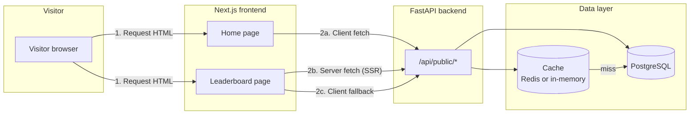
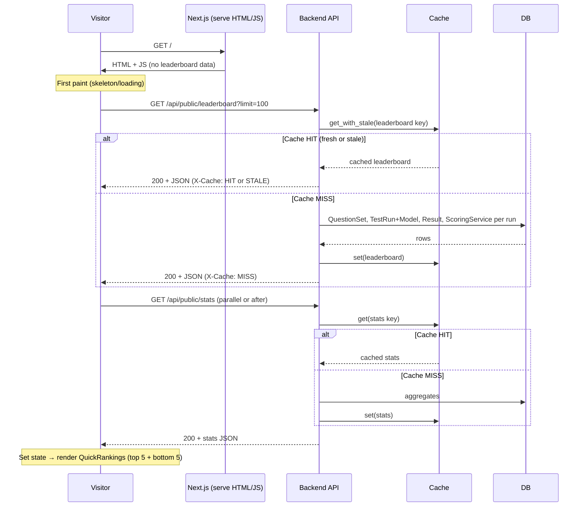
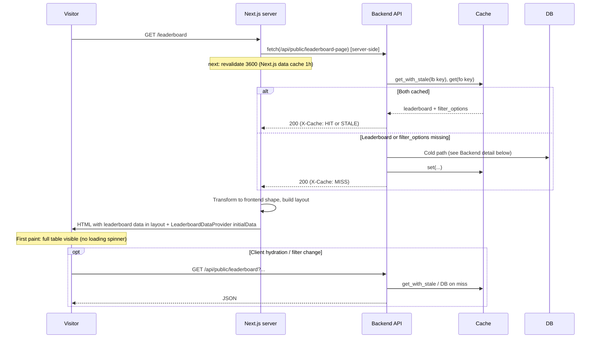
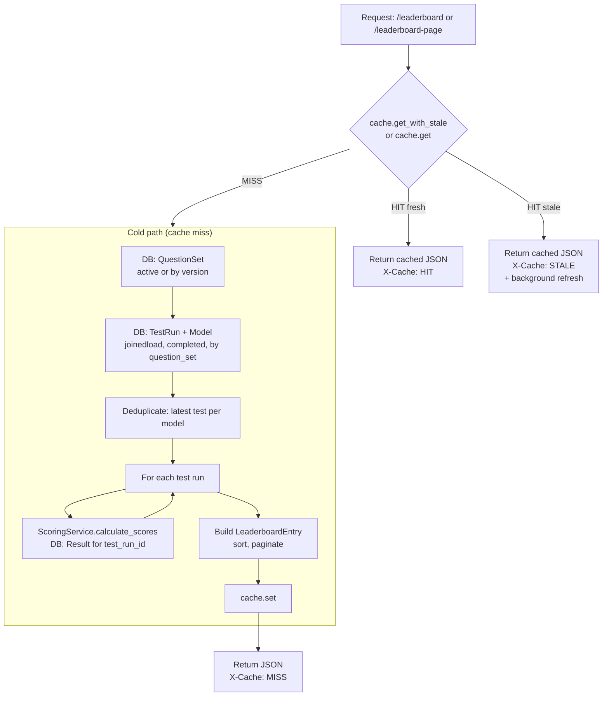
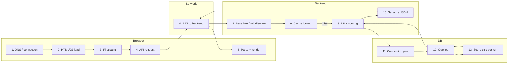

# Leaderboard Load Stack: Visitor → Home/Leaderboard → Database → Response

This document traces the full loading path from a visitor opening the site to the leaderboard (or home-page rankings) being rendered, including where latency can occur.

---

## 1. Visual flow map

### 1.1 High-level: two entry paths

### 1.2 Home page: QuickRankings (client-side)

The **home page** (`/`) is a client component. It does **not** server-render leaderboard data. On first paint the user sees loading state; then the browser runs `useEffect` and calls the backend.

**Lag points (home):**

| Step | Where | Cause |
|------|--------|--------|
| 1 | Network | Time to load HTML/JS from Next.js (or CDN). |
| 2 | Client | `useEffect` runs after paint → delay before first API call. |
| 3 | Network | Round-trip to backend for `leaderboard?limit=100` and `stats`. |
| 4 | Backend | Cache MISS: DB query + **per–test-run score calculation** (see below). |
| 5 | Client | React setState and re-render after both responses. |

---

### 1.3 Leaderboard page: SSR (preferred) and client fallback

The **leaderboard page** (`/leaderboard`) uses a **server layout** that fetches data so the first paint can include the table. There is also a client-side fallback and an optional prefetch from the header.

If the user **navigates to /leaderboard client-side** (e.g. from home) without a full reload:

- **Layout still runs on the server** for that route segment, so the server fetch above can still happen.
- If for any reason the layout doesn’t get `initialData` (e.g. error), `LeaderboardDataProvider` falls back to:
  1. **Prefetch cache** (if header hover prefetched leaderboard-page), or  
  2. **Client fetch**: `apiClient.getLeaderboardPage()` → same backend `/api/public/leaderboard-page`.

**Lag points (leaderboard):**

| Step | Where | Cause |
|------|--------|--------|
| 1 | Network | Time for visitor to get `/leaderboard` request to Next.js. |
| 2 | Next.js server | Layout `getLeaderboardPageData()` runs; `fetch(backend)` is blocking for this request. |
| 3 | Next.js data cache | First request misses; after 1h `revalidate` the next request may hit Next’s cache and skip backend. |
| 4 | Backend | Cache MISS on leaderboard or filter_options → DB + score generation (see below). |
| 5 | Serialization | JSON parse in layout + mapping to frontend shape. |
| 6 | Client | Hydration and any subsequent filter/pagination request. |

---

## 2. Backend: from request to database and back

### 2.1 Leaderboard endpoints

| Endpoint | Used by | Purpose |
|----------|---------|--------|
| `GET /api/public/leaderboard` | Home (limit=100), leaderboard filters/pagination | Single leaderboard view; cache key includes params. |
| `GET /api/public/leaderboard-page` | Leaderboard layout (SSR), prefetch, client fallback | One response: default leaderboard + filter_options. |

### 2.2 Backend flow for leaderboard data

### 2.3 Where backend time is spent (and where lags come from)

1. **Cache lookup**  
   - **Redis**: network RTT to Redis.  
   - **In-memory**: negligible.

2. **Cold path – database**  
   - **QuestionSet** query: one query, small.  
   - **TestRun + Model** (with `joinedload`): one query; can be large if many runs.  
   - **Per–test-run work** (main cost when cache is cold):  
     - For **each** “most recent” test run, `ScoringService.calculate_scores(db, test_run_id)` runs:  
       - `TestRun` lookup by id  
       - `Result` query for that `test_run_id`  
       - In-memory aggregation (tiers, categories, verdicts)  
     - So with 50 models you have on the order of 50+ extra DB round-trips (or batch equivalents) unless optimized.

3. **Filter options (leaderboard-page only)**  
   - If not cached: several distinct queries (providers, categories, trust_tiers, versions).  
   - Usually small and fast once DB is warm.

4. **Stale-while-revalidate**  
   - On STALE hit, response is sent immediately; refresh runs in background.  
   - No extra lag for that request; next request may get fresh data.

---

## 3. End-to-end stack summary (where lags can happen)

| # | Layer | What can lag |
|---|--------|----------------|
| 1 | Browser | DNS, TLS, connection to Next.js (or CDN). |
| 2 | Browser | Download HTML + JS bundles (size, number of requests). |
| 3 | Browser | First paint before any data (especially on home: no SSR leaderboard). |
| 4 | Browser | When `useEffect` runs and fires API calls (home); or layout server fetch (leaderboard). |
| 5 | Browser | Parsing JSON and React state update + re-render. |
| 6 | Network | RTT to backend (and backend → Redis if used). |
| 7 | Backend | Middleware (e.g. rate limit, security headers). |
| 8 | Backend | Cache lookup (Redis RTT or in-memory). |
| 9 | Backend | Cold path: building response from DB + scoring. |
| 10 | Backend | JSON serialization of large payload. |
| 11 | DB | Connection pool wait. |
| 12 | DB | Query time (QuestionSet, TestRun+Model, Result). |
| 13 | DB / app | **Per–test-run score calculation** (N queries or N batches) — largest cost on cold. |

---

## 4. Quick reference: code locations

| Layer | File / area |
|-------|-------------|
| Home page (client fetch) | `gcb-platform/frontend/app/page.tsx` — `useEffect` → `apiClient.getLeaderboard({ limit: 100 })`, `getStats()` |
| Leaderboard layout (SSR fetch) | `gcb-platform/frontend/app/leaderboard/layout.tsx` — `getLeaderboardPageData()` → `fetch(API_URL/api/public/leaderboard-page)` |
| Leaderboard client fallback | `gcb-platform/frontend/components/leaderboard/LeaderboardDataProvider.tsx` — prefetch cache or `apiClient.getLeaderboardPage()` |
| API client | `gcb-platform/frontend/lib/api.ts` — `getLeaderboard()`, `getLeaderboardPage()`, `API_URL` |
| Backend leaderboard | `gcb-platform/backend/app/api/v1/endpoints/public.py` — `get_leaderboard`, `get_leaderboard_page` |
| Backend cache | `gcb-platform/backend/app/core/cache.py` — `get_with_stale`, `set`; Redis or SimpleCache |
| Cold path leaderboard generation | `gcb-platform/backend/app/services/cache_warmer.py` — `_generate_leaderboard_data()` |
| Score calculation (per run) | `gcb-platform/backend/app/services/scoring.py` — `ScoringService.calculate_scores(db, test_run_id)`; queries `Result` |
| DB session | `gcb-platform/backend/app/core/auth.py` (or same app) — `get_db` |
| Cache warming at startup | `gcb-platform/backend/main.py` — lifespan → `warm_all_caches()`, `start_background_refresh()` |

---

## 5. Reducing lags: what to optimize first

1. **Avoid cold cache**  
   - Rely on cache warmer at startup and background refresh so most requests get cache HIT or STALE.

2. **Leaderboard page over home for “see leaderboard”**  
   - Leaderboard uses SSR + one `leaderboard-page` call; home uses client-side fetch of `leaderboard?limit=100` + `stats` after first paint.

3. **Backend cold path**  
   - Reduce per–test-run DB work: e.g. batch load all `Result` rows for the relevant test runs and compute scores in memory instead of one query per run.

4. **Next.js**  
   - `revalidate: 3600` on leaderboard layout fetch reduces repeated backend calls; ensure `API_URL` from server is fast (same region as backend).

5. **Network**  
   - Same region for Next.js, backend, Redis, and DB minimizes RTT; CDN for static assets improves step 2.

6. **Home page**  
   - If desired, add a small server-side fetch for “top 5” (or use a dedicated lightweight endpoint) so the home page can show rankings on first paint without waiting for client `getLeaderboard(100)`.

This flow map and the tables above should make it clear where each part of the stack runs and where lags are most likely (especially cache miss + per-run score calculation and client-side-first load on the home page).
